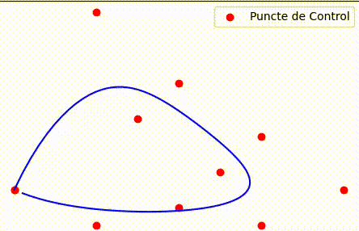
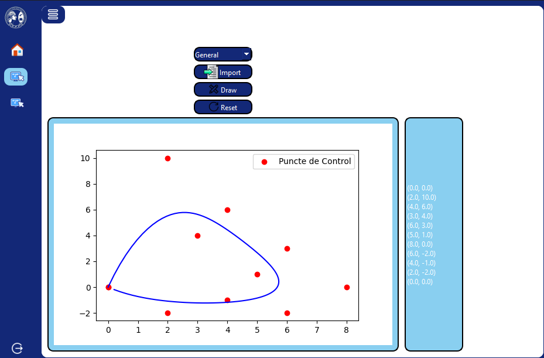
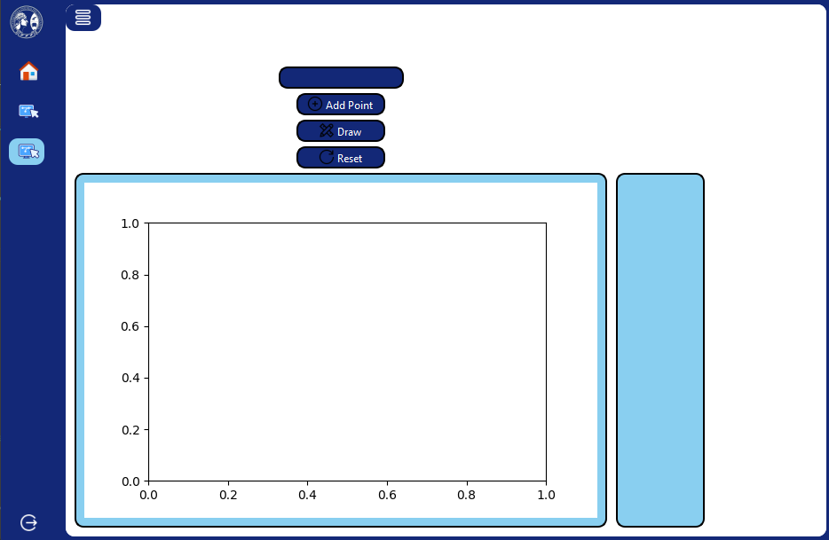
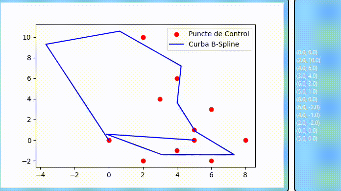

# 🎨 Curve Animator: Bezier and B-Spline Visualizer



> **Curve Animator** is a powerful and intuitive desktop application built with **Python**, **PySide6**, **Matplotlib**, and **NumPy**. It allows you to visualize and animate Bezier and B-Spline curves interactively, providing a hands-on understanding of how these curves are constructed.

---

## 📚 Overview

Curve Animator makes it easy to explore how Bezier and B-Spline curves behave by visualizing them in real time as you manipulate their control points.

---

## 🚀 Features

* 🎯 **Interactive Control Point Management**

  * Add points manually or import from a `.txt` file
  * Reset control points with a single click

* 📊 **Bezier Curve Visualization**

  * **Quadratic Bezier** (3 control points)
  * **Cubic Bezier** (4 control points)
  * **General Bezier** with any number of points using de Casteljau’s algorithm

* 🔀 **B-Spline Curve Visualization**

  * Smooth, local control and animation of B-Spline curves

* ⏱️ **Real-Time Animation**

  * Watch the curve being drawn step-by-step as `t` varies from 0 to 1

* 📊 **High-Quality Plots**

  * Rendered with Matplotlib for clarity and precision

* 🧽 **User-Friendly Interface**

  * Built with PySide6 for a modern, intuitive UI

* 📁 **File Import Support**

  * Load control points from a text file: each line should contain `x,y`

---

## 🖼️ Screenshots & GIFs

### Home Page

*A welcoming interface with navigation options*




---

### ✏️ Bezier Curve Animation


---

### 🧵 B-Spline Curve Animation



---

## 🛠 Installation

Make sure you have Python installed, then install the required libraries:

```bash
pip install PySide6 matplotlib numpy scipy
```

---

## ▶️ Usage

To run the application:

```bash
python main.py
```

> Assuming your main file is `main.py` and it integrates the other modules.

### 🧱 Navigation

* Use the buttons **Home**, **Bezier**, and **B-Spline** to switch sections.

### ➕ Add Control Points

* Manually: Enter coordinates (e.g., `10,20`) and click **Add Point**
* From file: Click **Import from File** and use a `.txt` file with lines like `x,y`

### 🧹 Bezier Curve Type

* On the Bezier page, choose **Quadratic**, **Cubic**, or **General** from the dropdown

### 🎮 Animate the Curve

* Click **Draw** to start the animation
* Click **Reset** to clear all points and the canvas

---

## 📓 Code Structure

```text
🔹 main.py                # Launches the PySide6 app and UI
🔹 bezier_animation.py    # Contains logic for Bezier curves (quadratic, cubic, general)
🔹 bspline_animation.py   # Contains logic for B-Spline curves
🔹 ui_Calcul_Numeric.py   # UI layout (generated via pyside6-uic)
🔹 coordonate.txt         # Example of coordinates
🔹 graphs/
    └── images/            # Contains GIFs and screenshots for README
```

---
